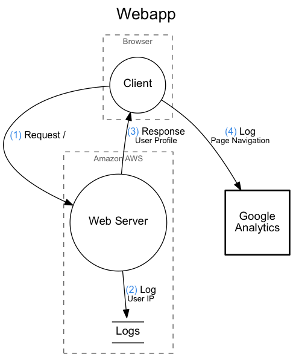

# DataFlow

Generate Graphviz documents from a Haskell representation.

## Getting Started

```
cabal install dataflow@0.6.0.0
```

## Usage


The following declarations is supported by DataFlow.

* `boundary 'Title' { ... }`
* `io identifier 'Title'`
* `function identifier 'Title'`
* `database identifier 'Title'`
* `identifier -> identifier 'Operation' 'Data Description'`

These are used inside a `diagram { ... }`.

## Example

```
diagram 'Webapp' {
  boundary 'Browser' {
    function client 'Client'
  }
  boundary 'Amazon AWS' {
    function server 'Web Server'
    database logs 'Logs'
  }
  io analytics 'Google<br/>Analytics'

  client -> server 'Request /' ''
  server -> logs 'Log' 'User IP'
  server -> client 'Response' 'User Profile'
  client -> analytics 'Log' 'Page Navigation'
}
```

Then generate your output with dot.

```bash
dataflow dfd webapp.flow | dot -Tpng > webapp.png
```

That should generate something like the following.



## Build

```
cabal sandbox init
cabal configure --enable-tests
cabal install --only-dependencies --enable-tests
```

## Building the Examples

```bash
make -C examples
```
## Haskell Docs

See [the Hackage site](https://hackage.haskell.org/package/dataflow).

## Release

```bash
cabal clean && cabal build && cabal sdist && cabal upload dist/dataflow-*.tar.gz
```
