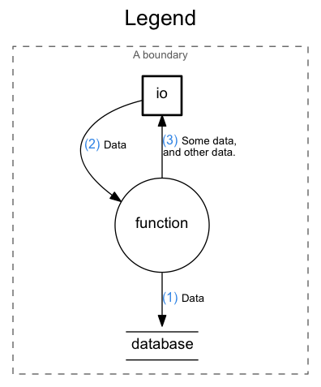
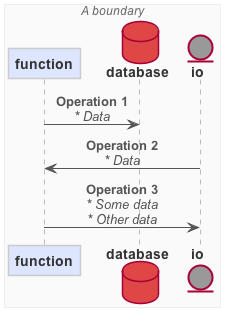

# DataFlow

Render graphs using a declarative markup. Currently supports DFD
(http://en.wikipedia.org/wiki/Data_flow_diagram) and sequence diagrams
(http://plantuml.sourceforge.net/sequence.html).


## Usage

The following forms are supported by DataFlow.

#### IDs

An ID can contain letters, numbers and underscores. It must start with a
letter.

<!--- Not dot code, but use dot code highlighter for .flow code -->
```dot
my_id_contain_4_words
```

#### Strings

String literals are written using double quotes.

```dot
"this is a string and it can contain everything but double quotes and newlines"
```

**NOTE!** Escaping characters inside strings is not supported at the moment.

#### Text Blocks

Text blocks are special strings, enclosed in backticks, that are can span
multiple lines in the source document. The space characters before the first
non-space characters on each line are trimmed, regardless of the indentation.

```dot
`this is
      a
  textblock`
```

... would render as:

```
this is
a
textblock
```

#### Attributes

Attributes are key-value pairs for diagrams and nodes that are used by
output renderers. Attributes are enclosed by curly brackets. For nodes that
can contain other nodes, attributes must appear before nodes.

Keys have the same rules as IDs. Values can be strings or text blocks.

```dot
{
  key1 = "attr value"
  key2 = `attr
          value`
}
```

#### `diagram`

`diagram` is the top-level form and must appear exactly once in a DataFlow
document. It can contain attributes and nodes.

```dot
diagram {
  title = "My diagram"
}
```

#### `boundary`

The `boundary` form declares a TrustBoundary node that can contain
attributes and other nodes. Boundaries are only allowed in the top-level
diagram.

```dot
diagram {
  boundary {
    title = "My System"
  }
}
```

#### nodes: `io`, `function`, `database`

The `io`, `function` and `database` forms declare `InputOutput`, `Function` and
`Database` nodes, respectively. The nodes have IDs and they can contain
attributes. Empty attribute brackets can be omitted.

```dot
diagram {
  io thing1

  io thing2 {
    title = "Thing 2"
  }
}

```

#### `->`

The `->` form declares a `Flow` between the nodes referenced by their
IDs. It can contain attributes. Empty attribute brackets can be omitted.
Flows must be declared after all nodes.

Note that the arrow can be reversed as well (`<-`).

```dot
diagram {
  thing1 -> thing2

  thing1 <- thing2 {
    operation = "Greet"
    data = "A nice greeting"
  }
}
```

#### Comment

Comments are written using `/*` and `*/` and are ignored by the Reader. They're
only used for human consumption.

```dot
diagram {
  /* I can write
   * whatever I
   * want in here! */
}
```

## Example

The image from the top of this README is rendered from the following DataFlow
document.

```dot
diagram {
  title = "Webapp"

  /* Some comment about this... */
  threats = `
    No particular threats at this point.

    It's **extremely** safe.`

  boundary {
    title = "Browser"

    function client {
      title = "Client"
    }
  }

  boundary {
    title = "Amazon AWS"

    function server {
      title = "Web Server"
    }
    database logs {
      title = "Logs"
    }
  }
  io analytics {
    title = "Google Analytics"
  }

  client -> server {
    operation = "Request /"
    description = `User navigates with a browser to see some content.`
  }
  server -> logs {
    operation = "Log"
    data = `The user
            IP address.`
    description = `Logged to a ELK stack.`
  }
  server -> client {
    operation = "Response"
    data = "User Profile"
    description = `The server responds with some HTML.`
  }
  analytics <- client {
    operation = "Log"
    data = "Page Navigation"
    description = `The Google Analytics plugin sends navigation
                   data to Google.`
  }
}
```

## Run DataFlow

The `dataflow` executable takes an output format and a DataFlow source document
and writes the output to `stdout`.

```bash
dataflow (dfd|seq) FILE
```

## DFD



To use the *DFD* output you need [Graphviz](http://www.graphviz.org/) installed.

```bash
dataflow dfd webapp.flow | dot -Tpng > webapp.png
```
### Output


## Sequence Diagram



You can use [PlantUML](http://plantuml.sourceforge.net/) to generate a sequence
diagram.

```bash
dataflow seq webapp.flow | java -Djava.awt.headless=true -jar plantuml.jar -tpng -pipe > webapp.png
```

### Output


## Templating

You can use [Hastache](https://github.com/lymar/hastache) to output arbitrary
text with its Mustache-like templates.

```bash
dataflow template template.ha webapp.flow > webapp.html
```

### Built-in Functions and Values

* `markdown` - Convert the attribute at the given key from Markdown to HTML.

  ```mustache
  {{#markdown}}my_markdown_attr{{/markdown}}
  ```

* `html_linebreaks` - Replace `\n` with `<br/>` elements in the attribute at
  the given key, to retain linebreaks in HTML output.

  ```mustache
  {{#html_linebreaks}}my_formatted_attr{{/html_linebreaks}}
  ```

* `filename_without_extension` - The input `.flow` file name with no path and
  no extension. Useful when generating graphics and text/HTML with matching
  filenames (e.g. `my-flow.html` includes `my-flow.png`).

  ```mustache
  
  ```

* `flows` - a list of all the Flow nodes in the diagram. Attributes of the
  flow is accessible inside the iteration scope.

  ```mustache
  <ol>
  {{#flows}}
    <li>{{description}}</li>
  {{/flows}}
  </ol>
  ```

For an example see [template.ha](examples/template.ha) and the output HTML in
[webapp.html](examples/webapp.html).

### Output


## Makefile Example

The following Makefile finds `.flow` sources in `src` and generates DFDs, in
SVG format, in `dist`.

```make
SOURCES=$(shell find src/*.flow)
TARGETS=$(SOURCES:src/%.flow=dist/%.dfd.svg)

K := $(if $(shell which dataflow),,$(error "No dataflow executable in PATH. See https://github.com/SonyMobile/dataflow for install instructions)))"))

dist/%.dfd.svg: src/%.flow
	@dataflow dfd $< | dot -Tsvg > $@

dfd: $(TARGETS)

clean:
  rm -f $(TARGETS)
```

## Build Instructions

See [BUILD.md](BUILD.md).

## License

BSD-3, see [LICENSE](LICENSE).
